# CourseConnect

### Welcome to CourseConnect! 

Course Connect is an app to **anonymously** connect classmates at the University of Waterloo! Securely login and anonymously create course specific posts to match and chat! Use this for specific assignments, labs, or quizzes for any class such as *wink wink* CLAS104.

## Overview
How did I create this? Visit a high level overview:

**Front End**: React Native *with Expo*

**Backend**: FastAPI *with Pydantic Schemas, Websockets, SQLAlchemy*

**Database**: PostgreSQL

**User Authentication**: AUTH0 By Okta

**Chat Implementation**: Websockets (FastAPI <=> React)

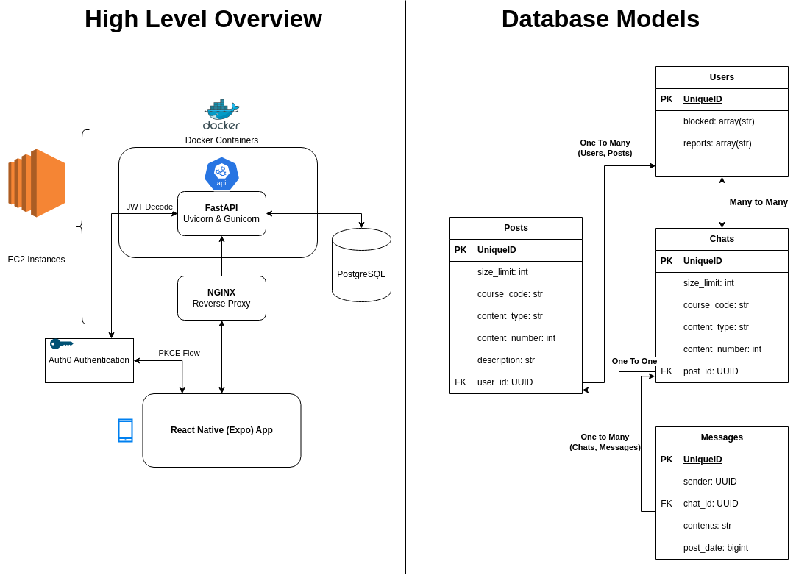

## Features
- Anonymously create posts for course assignments, labs, quizzes, etc. Wait until someone matches with it, and then chat away!

## Preview
Here are some preview images of CourseConnect:

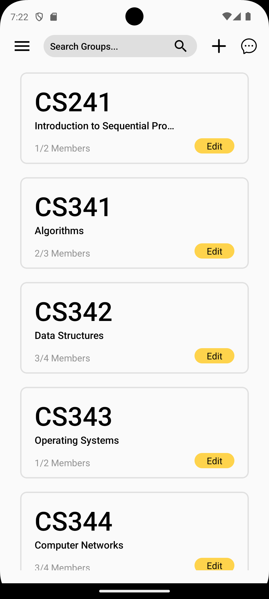
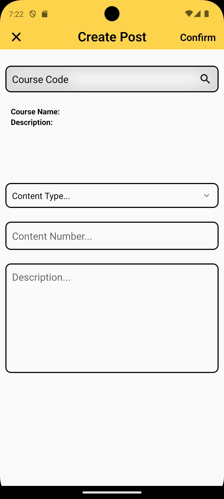
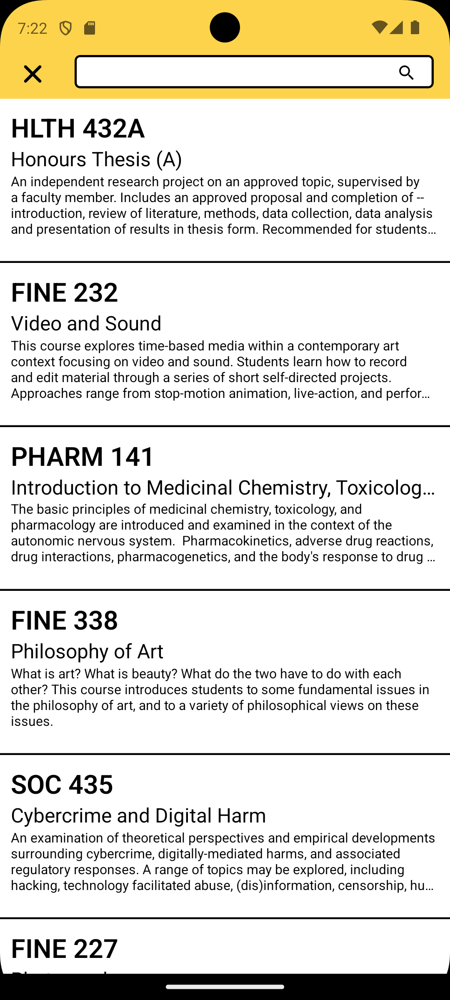
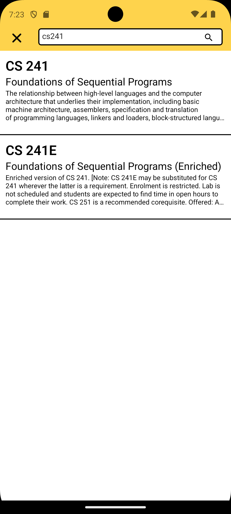
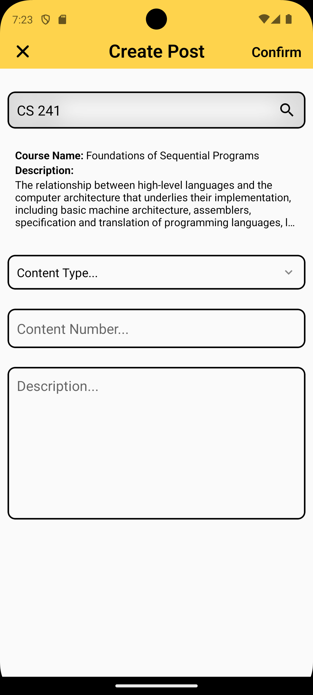
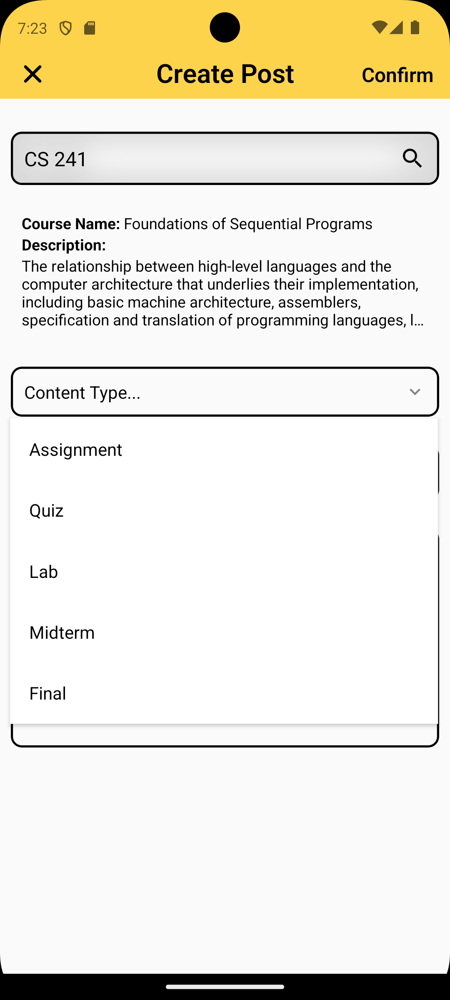
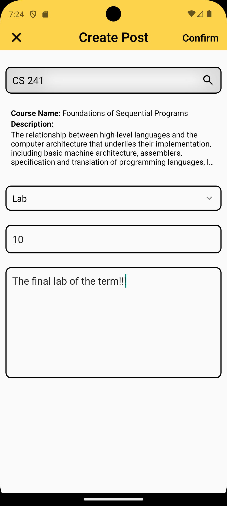
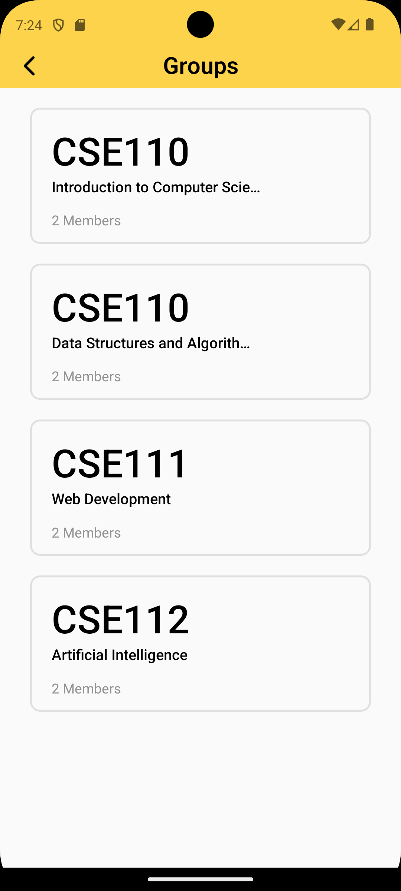
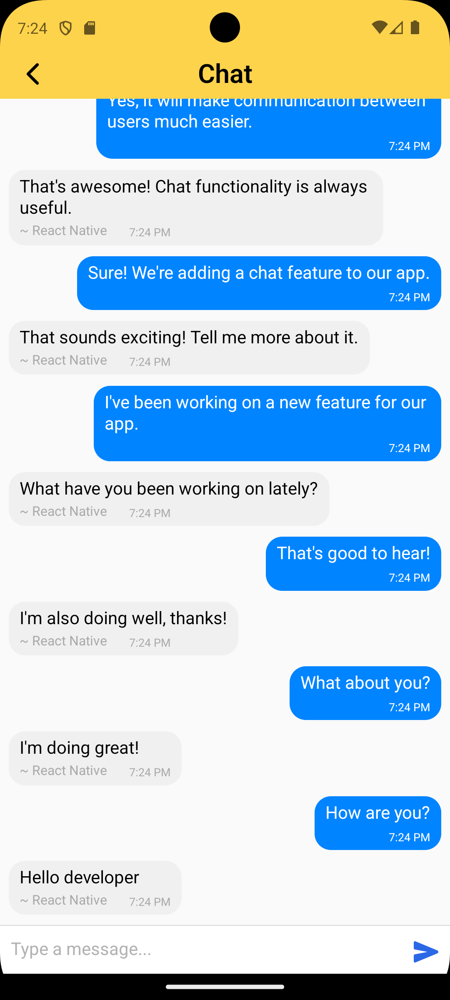
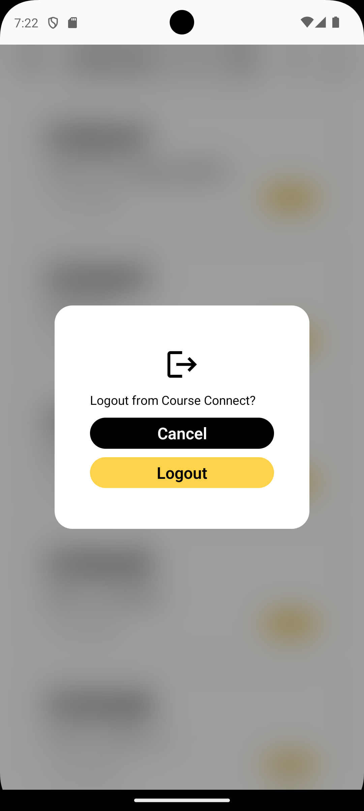

Feel free to explore the app and see how it works!

## Mentions 
Thanks to Eugene Lee for creating a Figma Wireframe. [Link](https://www.figma.com/design/IBsMThM0eORSRxn2Xs5hHr/UWCourseConnect?node-id=0-1&t=Ub1CybyDOVu5Q1Gb-1)

GiftedChat: Chat UI [Link]((https://github.com/FaridSafi/react-native-gifted-chat))

## License

CourseConnect is licensed under the [MIT License](LICENSE).
